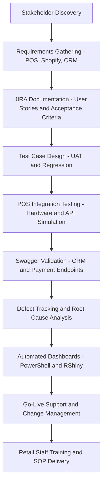
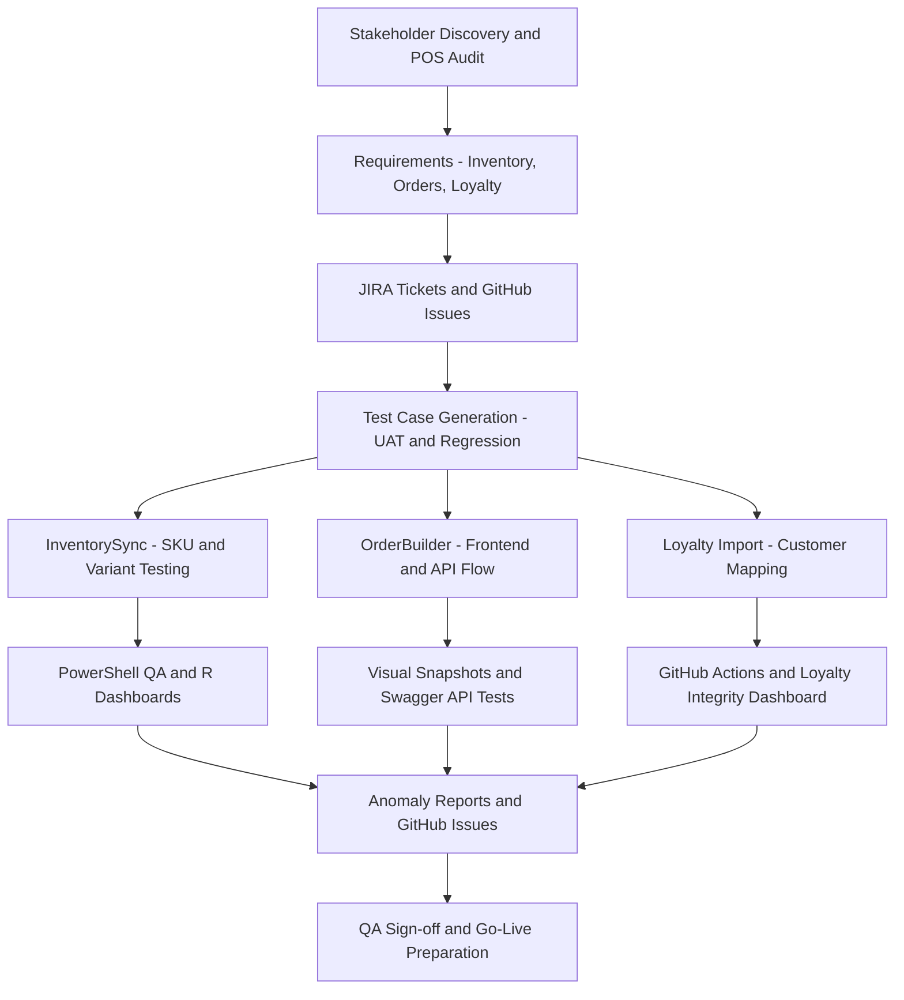

# 🧪 ResultStack Interview Showcase: QA + POS Integration Upgrade

## 📌 Project Overview

This GitHub-style README outlines Maurice McDonald's professional experience, technical QA capabilities, and a proposed solution architecture for a modern retail POS upgrade, inspired by prior research conducted at Pinto Ranch. It is tailored to demonstrate strategic value for a Software QA Analyst role at ResultStack.

---

## 👋 About Me

**Maurice McDonald**
Technical Business Analyst | QA Strategist | AI-Augmented Tester

> "12 years of experience at WPP, NCR, InEight, and D.R. Horton blending documentation, UAT cycles, API logic, and AI-enhanced automation. I build smart QA tools that scale."

---

## 🛠️ Relevant Skills & Tools

| Category          | Technologies / Platforms                                                               |
| ----------------- | -------------------------------------------------------------------------------------- |
| QA & Testing      | UAT, Regression, Edge Cases, Test Suites, Manual Testing, Log Monitoring               |
| Documentation     | JIRA (WPP), SOPs, User Stories, GitHub Enterprise Migration Docs                       |
| Retail & POS      | NCR Silver, POS Rollouts, Shopify Upgrade Strategy, Pinto Ranch Workflow Design        |
| DevOps/Automation | Git, PowerShell, CMD, Swagger (personal app use), Change Advisory Boards (D.R. Horton) |
| AI/ML QA Tools    | R, RShiny, ggplot2, data.table, caret, custom dashboards (e.g., BrisketSentinel)       |

---

## 🚀 Proposed POS Integration Upgrade — Pinto Ranch Scenario

This hypothetical project simulates what Maurice can contribute at ResultStack.

### 🎯 Objective

To provide a future-ready, QA-driven POS system upgrade for a retail brand (e.g., Pinto Ranch), migrating from a legacy POS to Shopify with QA automation, UAT validation, and integration with internal CRM and payment APIs.

---

## 🔄 Proposed End-to-End QA Integration Workflow



---

## 🔍 Highlighted QA Projects

### 1. **BrisketSentinel**

* **Use Case:** Simulates smoking logs with PowerShell + RShiny
* **Value:** AI detects cancer thresholds and triggers alerts — shows ability to log/test physical variables

### 2. **Swagger Log Monitor (Vite Build)**

* **Use Case:** Full-stack Swagger-tested API logger rebuilt in Vite
* **Value:** End-to-end API validation and Swagger-based testing shows proactive engineering

---

## 💡 Key Talking Points for ResultStack Interview

* "At Pinto Ranch, I wasn't just a sales associate—I proactively built diagrams and researched Shopify POS upgrades. That same mindset is what I’d bring to ResultStack."
* "At WPP, all of our QA documentation and GitHub migration planning happened inside JIRA—so I’m fluent in using tickets as the single source of truth."
* "I've built dashboards that test, alert, and explain—automated log monitoring, regression flagging, and real-time data visuals."

---

## 📈 STAR Example

**Situation:** At D.R. Horton, QA testing was behind schedule for a critical CRM workflow.
**Task:** Validate mortgage-linked CRM logic across multiple systems.
**Action:** Prioritized critical test cases, coordinated with devs, conducted joint UAT.
**Result:** On-time release with <1% post-launch issues.

---

## 📫 Contact

**GitHub:** [emcdo411](https://github.com/emcdo411)
**Location:** Dallas / Fort Worth
**Interests:** QA + AI Automation, Retail Tech, RShiny Dashboards

---

## 🧩 Core Modules

### 1. **InventorySync AI**

**Goal:** Sync legacy SKUs, variants, and quantities to Shopify POS while catching discrepancies.

* ✅ PowerShell log ingestion
* ✅ RShiny dashboard for mismatch visualization
* ✅ GitHub Issues auto-generated from anomalies

### 2. **CustomFitter Builder**

**Goal:** Support custom product orders (e.g., boots, hats, exotic materials) built with Shopify metafields.

* ✅ React + Vite frontend
* ✅ Snapshot visual testing
* ✅ Swagger endpoint simulations for custom product logic

### 3. **WranglerRewards Mapper**

**Goal:** Import legacy loyalty program data and track tagging, redemption, and retention alignment.

* ✅ Automated tier mapping via Shopify API
* ✅ GitHub Action for regression testing
* ✅ R dashboard for loyalty validation breakdowns

---

## 🔄 Full Workflow Diagram (All Modules)



---

## 🛠️ Tech Stack

| Layer       | Stack/Tools                                                                |
| ----------- | -------------------------------------------------------------------------- |
| Frontend    | React, Vite, Tailwind                                                      |
| Backend/API | Node.js or FastAPI, Shopify Admin & Checkout API                           |
| QA/Testing  | PowerShell, Swagger, GitHub Actions, Snapshot Testing, Percy.io (optional) |
| Dashboards  | R + RShiny                                                                 |
| DevOps      | GitHub Issues, Projects, Actions, Mermaid Diagrams                         |

---

## 📁 GitHub Repository Layout

```bash
trailsync-ai/
├── README.md
├── docs/
│   ├── architecture.md
│   ├── diagrams/
│   │   └── pos-workflow.mmd
│   └── SOPs/
├── dashboards/
│   ├── inventory_dash.R
│   └── loyalty_monitor.R
├── src/
│   ├── orderbuilder_frontend/
│   ├── loyalty_import/
│   └── inventory_sync/
├── tests/
│   ├── swagger/
│   ├── snapshots/
│   └── powershell/
├── .github/
│   └── workflows/
│       └── ci-qa-validation.yml
└── issues/
    ├── inventory-mismatch.md
    ├── order-builder-failures.md
    └── loyalty-tag-errors.md
```

---


